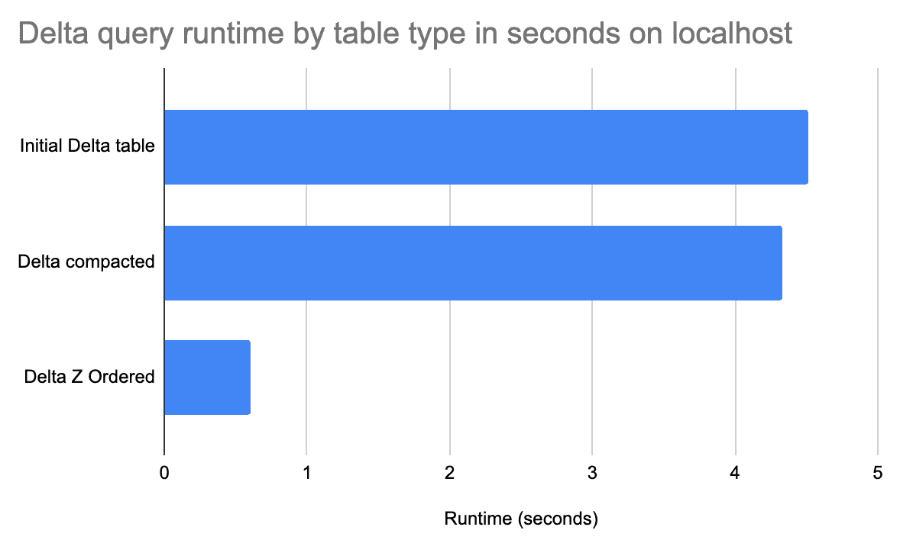
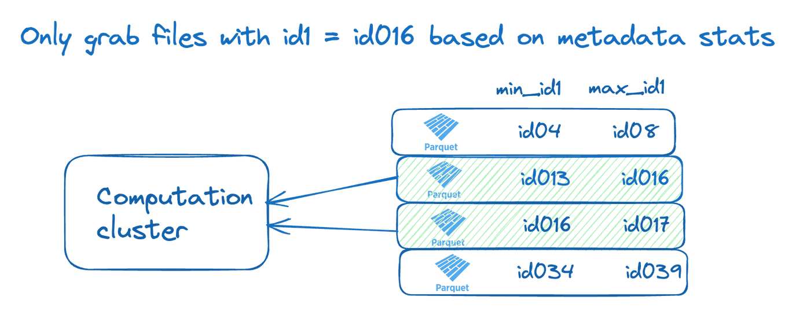

Delta lake Z ordering and Hive-style partitioning are techniques for grouping similar data in the same files.

# Overview
Z ordering your data reorganizes the data in storage and allows certain queries to read less data, so they run faster. When data is organized appropriately, more files can be skipped

Z ordering is good when querying on one or multiple columns

# Example

## Build up

|  id1|  id2|         id3|id4|id5|   id6| v1| v2|       v3|
|-----|-----|------------|---|---|------|---|---|---------|
|id016|id046|id0000109363| 88| 13|146094|  4|  6|18.837686|
|id039|id087|id0000466766| 14| 30|111330|  4| 14|46.797328|
|id095|id078|id0000584803| 56| 92|213320|  1|  9|63.464315|

Suppose we have a billion rows of above kind(9 columns).
And we'd like to run the query
```sql
SELECT ID1, SUM(V1) AS V1 FROM THE ABOVE_TABLE WHERE ID1='id016' GROUP BY ID1
```

```python
spark.sql(
    "select id1, sum(v1) as v1 from x0 where id1 = 'id016' group by id1"
).collect()
```

The Delta table is initially stored in 395 files(say), and the rows with `id1='id016'` are dispersed throughout all the files, so none of the files can be skipped when the query is run.

## Applying optimization

We can apply `optimize` method onto the delta table(which will compact the Delta table so it does not contain unnecessarily small files)
No doubt, it will take less time when optimized. One caveat is, on small dataset, compacting the files doesn't help the query runtime much. On a larger dataset with more small files, the compaction can materially speed up the query runtime.

```python
delta_table = DeltaTable.forPath(spark, delta_path)
delta_table.optimize().executeCompaction()
```
# Applying Z Order

Let's Z order the data by id1, so the rows with `id1='id016'` are grouped together and not spread across all the files.

Now we only have rows with `id1='id016'` in 1 of the compacted files. The query runtime will be much less.

Z Ordering data can significantly improve query performance. This graph shows the query time by Delta table version:


		(This result was collected for 1 billion rows, 395 delta table files, 27 compact files)
```python
(
    delta.DeltaTable.forPath(spark, table_path)
    .optimize()
    .executeZOrderBy("id1")
)
```
# Why it works
Z ordering basically, groups the columns specified, and thus makes skipping over files. How?

Transferring data from storage to memory is expensive, so **caching** can improve speed.
Delta tables store per-file metadata in the transaction log(caching). Engine can consult when running queries, and they can use to skip over files that do not contain data that is needed for the query.

To make this possible, Delta tables store min/max values for columns in each file.



Here computation cluster will only access 2 files which contain the ***id016***.

*Z Ordering helps our queries run faster because it makes irrelevant files easy to skip*

# Delta Lake Z Order by Multiple Columns

Let's say, we have following types of queries which are run frequently:
* Query A: 
```SQL
SELECT ID1, SUM(V1) AS V1 FROM ABOVE_TABLE WHERE ID1='id016' GROUP BY ID1
```

* Query B:
```sql
SELECT ID2, SUM(V1) AS V1 FROM ABOVE_TABLE WHERE ID2='id047' GROUP BY id2
```

* Query C:
```sql
SELECT ID1, ID2, SUM(V1) WHERE ID1='id016' AND ID2='id047' GROUP BY ID1, ID2
```

So, looking at queries, Z ordering on **id1** and **id2** could be good. And indeed, Z Ordering by **id1** and **id2** provides a nice performance boost for all the queries.

Note: For a large dataset, Query A will run faster for the Delta table that's only Z Ordered by id1 and slower for the Delta table that's Z Ordered by `id1` and `id2`. 
Z Ordering by multiple columns limits the ability for a column's data to be collocated.

*Z Ordering has tradeoffs, so it's important to analyze query patterns and select the right columns when Z Ordering our data*

# Partitioning vs Ordering

## Partitioning
Partitioning by a column guarantees complete data separation. There will be a separate directory for each value in that column.

This could go wrong, when we partition by a column with too many distinct values. Lots of small files may be created depending on the size of the dataset.

General guidelines:
* Don't partition tables under 1TB
* Don't partition by a column that will have partitions with less than 1GB of data.
* Don't partition a table that's updated frequently, or we will run into [[#Small File Problem]]

## Z Ordering

Z Ordering groups similar data in the same files without creating directories.

We can Z Order and incrementally append to avoid some [[#Small File Problem]] created by Hive-style partitioning.

*We can do both Hive-style partitioning and Z Ordering.*

# When Z Ordering is bad

Z Ordering only helps improve query performance if it can help us skip files.

If we apply Z Ordering on wrong column, then the queries' runtime will suffer badly.

# Small File Problem

Some key sources of overhead:
* File metadata storage in memory - Storing metadata for a large number of small files takes up a lot of memory on the driver.
* Increased memory pressure on executors - When working with a dataset spread across small files, each executor task processes fewer records per file. This increases memory pressure
* High task scheduling overhead - With small files, Spark ends up creating many tasks to process the dataset. The overhead of scheduling and coordinating these tasks reduces performance.
* Sub-optimal disk I/O - Reading from a large number of small files leads to random disk I/O, which is very inefficient.
* Reduced Parallelism - Spark's parallel processing capabilities are based on dividing data into partitions and executing tasks on each partition concurrently. With an abundance of small files, the number of partitions increase exponentially, leading to reduced parallelism and slower overall execution times.
* Serialization costs - Serializing and deserializing data from many small files has CPU costs.
In summary, having many small files results in high metadata overhead, increased memory pressure, inefficient disk I/O, CPU costs, Reduced parallelism and Serialization costs - all of which can significantly slow down the Spark jobs.

# Overcoming [[#Small File Problem]]

Effective strategies:
* Combine small files into larger files: Preprocessing to pack small files into larger files. 
* Use file formats with small metadata - File formats like Parquet and ORC require less metadata storage compared to formats like JSON. Converting small files to Parquet can help as Spark works very well with Parquet.
* Increase Parallelism: Using repartition and coalesce to increase the number of partitions.
* File compression: Compressing files reduces storage requirements, optimizes I/O operations, and improves data transfer across the network.
* Data Ingestion Optimization: When ingesting data into Spark, consider using larger batch sizes, or buffering techniques to reduce the number of small files generated. 